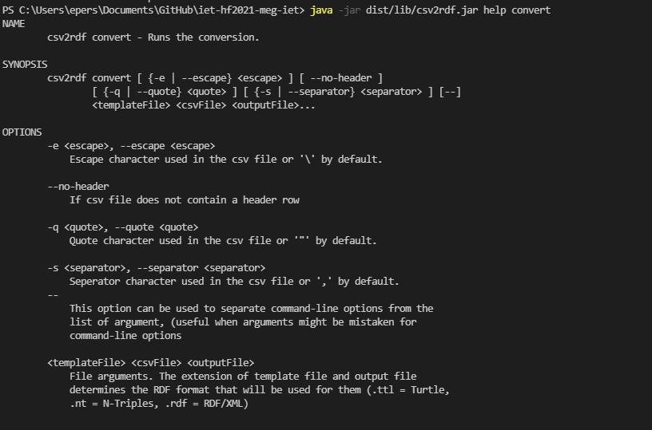

# Manuális tesztek

A program bemeneteit és a generált kimeneteit vizsgáljuk.
A konverziókat a lefordított állomány futtatásával, CLI-on keresztül végezhetjük.
A lehetséges opciókat az alábbi paranccsal lehet kilistázni:

`java -jar dist/lib/csv2rdf.jar help convert`

A help kimenete:



Ezeknek a funkcióknak a működését teszteljük. A manuális teszthez szükségünk van több bemeneti csv-re és a belőlük generált elvárt fájl template-jére.
A tesztekhez előállított file-ok a manual-tests mappában találhatóak. Ezeket a bemeneteket a cars példa csv-ből és template-ből kiindulva állítottuk össze.

## Alapvető működés

### Input:

Az examples/cars/cars.csv és az example/cars/template.ttl file.

### A futtatott parancs:

`java -jar dist/lib/csv2rdf.jar convert examples/cars/template.ttl examples/cars/cars.csv manual-tests/cars.ttl`

### Output:

```
CSV to RDF conversion started...
Template: examples\cars\template.ttl
Input   : examples\cars\cars.csv
Output  : manual-tests\cars.ttl
Converted 4 rows to 76 triples
```

A kimeneti manual-tests/cars.ttl file azonos a példában megadott examples/cars/cars.ttl tartalmával.

## Eltérő escape karakter használata:

### Input:

Az escape-char.csv, az examples/cars/cars.csv módosított változata amely `/` karaktereket használja escape karakternek az alapértelmezett `\` helyett.

Használat a bemeneti csv rekordjának Description mezőjében:
`1997,Ford,E350,"this is an /"inner quote/"",3000.00`

A bemeneti template azonos marad (examples/cars/template.ttl).

### A futtatott parancs:

`java -jar dist/lib/csv2rdf.jar convert -e '/' examples/cars/template.ttl manual-tests/escape-char.csv manual-tests/escape-char.ttl`

### Output:

```
CSV to RDF conversion started...
Template: examples\cars\template.ttl
Input   : manual-tests\escape-char.csv
Output  : manual-tests\escape-char.ttl
Converted 4 rows to 76 triples
```

A fenti bemeneti rekordnak megfelelő kimenet:

```
:Offer-m82jefftfv61mrqr6616eoigmu582h34 a gr:Offering ;
	rdfs:comment "this is an \"inner quote\"" ;
	gr:includes :Car-1 ;
	gr:hasBusinessFunction gr:Sell ;
	gr:hasPriceSpecification _:node1f5npapifx1 .
```

A kimeneti escape-char.ttl file ezen kívül azonos a példában megadott examples/cars/cars.ttl tartalmával.

## Eltérő quote karakter használata:

### Input:

A quote-char.csv, az examples/cars/cars.csv módosított változata amely `'` karaktereket használ az alapértelmezett `"` helyett. A bemeneti template azonos marad (examples/cars/template.ttl).

### A futtatott parancs:

`java -jar dist/lib/csv2rdf.jar convert -q "'" examples/cars/template.ttl manual-tests/quote-char.csv manual-tests/quote-char.ttl`

### Output:

```
CSV to RDF conversion started...
Template: examples\cars\template.ttl
Input   : manual-tests\quote-char.csv
Output  : manual-tests\quote-char.ttl
Converted 4 rows to 76 triples
```

A kimeneti quote-char.ttl file azonos a példában megadott examples/cars/cars.ttl tartalmával.

## Eltérő elválasztó karakter használata:

### Input:

A separator-char.csv, az examples/cars/cars.cs) módosított változata amely `;` karaktereket használ elválasztáshoz. A bemeneti template azonos marad (examples/cars/template.ttl).

### A futtatott parancs:

`java -jar dist/lib/csv2rdf.jar convert -s ';' examples/cars/template.ttl manual-tests/separator-char.csv manual-tests/separator-char.ttl`

### Output:

```
CSV to RDF conversion started...
Template: examples\cars\template.ttl
Input   : manual-tests\separator-char.csv
Output  : manual-tests\separator-char.ttl
Converted 4 rows to 76 triples
```

A kimeneti separator-char.ttl file azonos a példában megadott examples/cars/cars.ttl tartalmával.

## Header nélküli csv konverziója:

### A futtatott parancs:

`java -jar dist/lib/csv2rdf.jar examples/cars/template.ttl manual-tests/no-headers.csv manual-tests/no-headers.ttl`

Ilyenkor a template file-ban nem hivatkozhatunk közvetlenül az oszlopok neveire. Ehelyett az oszlopok sorszámával tudunk a tartalmukra hivatkozni. Az ez alapján átírt template a no-headers-template.ttl file-ban található.

### Output

```
CSV to RDF conversion started...
Template: manual-tests\no-headers-template.ttl
Input   : manual-tests\no-headers.csv
Output  : manual-tests\no-headers.ttl
Converted 4 rows to 76 triples
```

A kimeneti no-headers.ttl file azonos a példában megadott examples/cars/cars.ttl tartalmával.

## Hibajelzések:

A program nem megfelelő bemenetek esetén létrehozza a kimeneti fájlt, de ezután futási idejű hibát dob és az ehhez tartozó szöveges üzenetet írja ki a szabványos kimenetre.
Néhány példa:

### Nem létező file a bemeneten:

Input:

`java -jar dist/lib/csv2rdf.jar convert non-existent.ttl examples/cars/cars.csv manual-tests/result.ttl`

Output:

```
CSV to RDF conversion started...
Template: non-existent.ttl
Input   : examples\cars\cars.csv
Output  : manual-tests\result.ttl
ERROR: java.io.FileNotFoundException: non-existent.ttl (The system cannot find the file specified)
java.lang.RuntimeException: java.io.FileNotFoundException: non-existent.ttl (The system cannot find the file specified)
        at com.complexible.common.csv.CSV2RDF.run(CSV2RDF.java:123)
        at com.complexible.common.csv.CSV2RDF.main(CSV2RDF.java:430)
Caused by: java.io.FileNotFoundException: non-existent.ttl (The system cannot find the file specified)
        at java.base/java.io.FileInputStream.open0(Native Method)
        at java.base/java.io.FileInputStream.open(FileInputStream.java:211)
        at java.base/java.io.FileInputStream.<init>(FileInputStream.java:153)
        at com.google.common.io.Files$FileByteSource.openStream(Files.java:127)
        at com.google.common.io.Files$FileByteSource.openStream(Files.java:117)
        at com.google.common.io.ByteSource$AsCharSource.openStream(ByteSource.java:404)
        at com.google.common.io.CharSource.read(CharSource.java:155)
        at com.google.common.io.Files.toString(Files.java:391)
        at com.complexible.common.csv.CSV2RDF$Template.insertPlaceholders(CSV2RDF.java:161)
        at com.complexible.common.csv.CSV2RDF$Template.parseTemplate(CSV2RDF.java:206)
        at com.complexible.common.csv.CSV2RDF$Template.<init>(CSV2RDF.java:155)
        at com.complexible.common.csv.CSV2RDF.run(CSV2RDF.java:106)
        ... 1 more
```

### Üres file a bemeneten:

Input:

`java -jar dist/lib/csv2rdf.jar convert manual-tests/template.ttl manual-tests/empty.csv manual-tests/result.ttl`

Output:

```
CSV to RDF conversion started...
Template: manual-tests\template.ttl
Input   : manual-tests\empty.csv
Output  : manual-tests\result.ttl
ERROR: java.lang.NullPointerException: Input file is empty!
java.lang.RuntimeException: java.lang.NullPointerException: Input file is empty!
        at com.complexible.common.csv.CSV2RDF.run(CSV2RDF.java:123)
        at com.complexible.common.csv.CSV2RDF.main(CSV2RDF.java:430)
Caused by: java.lang.NullPointerException: Input file is empty!
        at com.google.common.base.Preconditions.checkNotNull(Preconditions.java:209)
        at com.complexible.common.csv.CSV2RDF.run(CSV2RDF.java:101)
        ... 1 more
```
## Konklúzó
Ezek alapján a program megfelelő bemenetek megadásával elvégzi a konverziókat és biztosítja a megadott funkciókat. A hibajelzés és a fehasználóval való interakció viszont hagy kívánnivalót maga után. A hibakezelés hiánya kissé megnehezíti az eszköz gördülékeny használatát. A stack trace kiírása a standard outputra szoftverbiztonsági kérdéseket is felvet.
