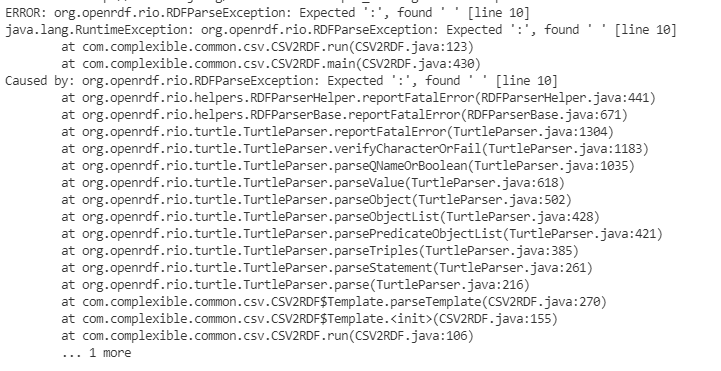

# Nem-funkcionális jellemzők vizsgálata

Alapvetően 4 különböző nem-funkcionális jellemző vizsgálatát végeztük el, ezek a biztonság és a használhatóság, a teljesítmény és a stresszteszt.

## Biztonsági teszt

_A teszt célja kimeríteni a szoftver esetleges biztonsági réseit és potenciális hibalehetőségeit_

A biztonsági teszt 7 fő lépésből áll, melyek az alábbiak:

- Sebezhetőségi vizsgálat
- Biztonsági vizsgálat
- Penetrációs vizsgálat
- Kockázatértékelés
- Biztonsági auditálás
- Etikus hackelés
- Állapotfelmérés

Ezek közül mi a **sebezhetőségi vizsgálat**ra koncentráluk legfőképp, továbbá a manuálisan is végezhető **biztonsági auditálás**ra. Elsőként a SonarQube eszköz által észlelt biztonsági hibákat detektáltuk, mely röviden arról írt, hogy ne a System.out-ot használjuk a hibák megjelenítésére, hanem használjunk loggert helyette.

A CSV fájlok olvasására használt külső könyvtár jól kezeli a biztonsági kockázatokat jelentő egyéb kiterjesztésű fájlok olvasását.

A SonarCloud nem jelzett bizonsági hibákat, sem sebezhetőségeket.

Külső fájlok beolvasása mindig is kockázatos folyamatnak minősült, de nem sikerült olyan adatot csempésznünk a bemeneti fájlba, ami miatt a könyvtár kockázatosan viselkedett volna.

Konklúzióként a könyvtárat biztonságosnak ítléjük meg.

## Használhatósági teszt

_Más néven UX testing, célja kideríteni, hogy mennyire felhasználóbarát az eszköz, továbbá mennyire egyszerű használni azt._

A következő teszt esetek merülnek fel:

- A rendszer hatékonysága
- A rendszer pontossága
- A rendszer felhasználó barátsága

A teljesség igénye érdekében közösen megalkotott vélemények és tapasztalatok után jutottunk a következő eredményekre.

A CSV2RDF egy egyszerű, és könnyen kezelhető könyvtár. A neve önmagában sokatmondó, és lefedi a kevés funkciója által nyújtott szűk képességeinek halmazát. A rendszer hatékonysága egy külön dokumentációban kerül részletes kifejtésre.

Tapasztalataink alapján a tervezők a fejlesztés során - a könyvtár egyszerűsége révén - öszpontosítottak a pontosságra, és tesztjeink során kiderült, hogy jól alkalmazkodik nem várt felhasználói viselkedésekhez, azonban a hibák és a kivételek kezelése hagy némi kivánnivalót maga után. Ha valami hibaüzenet lép fel, az nem túl informatív, valamint nem a legpontosabb visszajelzéseket kapja a felhasználó.

Ezen tapasztalatok során arra jutottunk, hogy kezelni, valamint használni a könyvtárat nem okoz nehézségeket, és a rövid és tömör dokumentáció elégnek bizonyul. A jövőbeni használhatóság érdekében mindenképp javasoljuk az egyedi kivételek létrehozását, és alkalmazását, továbbá kiterjeszteni a hibák detektálásának spektrumát.

## Teljesítmény tesztek

A program nem-funkcionális jellemzői közül ez a dokumentum tartalmazza a teljesítmény teszteket.
Ennek méréséhez a programot kiegészítettem az alábbi pár sorral, amely a futás elejétől a végéig eltelt időt méri ezredmásodpercben.

```
long start = System.currentTimeMillis();
Cli.<Runnable> builder("csv2rdf").withDescription("Converts a CSV file to RDF based on a given template")
.withDefaultCommand(CSV2RDF.class).withCommand(CSV2RDF.class).withCommand(Help.class)
.build().parse(args).run();
long finish = System.currentTimeMillis();
System.out.println("Elapsed time in milliseconds " + (finish - start));

```

Ezután változó méretű csv fájlok konvertálását futtattam, változó bonyolultságú template-ek mellett.
A teszteléshez használt csv fájlok, a használt template-ek és a generált output-ok a performance-tests mappában találhatóak.

### 1. teszt: Szélerőművek

#### Input

A performance-tests/wind.csv fájl egy szélerőmű óránkénti termelését tartalmazza. Minden oszlop egy év adatait jelenti. A fájlban összesen 5 év adata van (2016-2020, 8,760 sor).

#### A lefuttatott parancs

`java -jar dist/lib/csv2rdf.jar convert --no-header stress-test/wind-template.ttl stress-test/wind.csv stress-test/wind-output.ttl`

#### Output a standard kimeneten

```
Template: stress-test\wind-template.ttl
Output  : stress-test\wind-output.ttl
Converted 8,760 rows to 131,400 triples
Elapsed time in milliseconds 517
```

## Stresszteszt

Az alkalmazás jellegéből adódóan nehezen találni szűk keresztmetszetet rajta, hiszen egy szálon futó, rövid életű programról beszélhetünk. Két input fájlt kell megnyitnia, egy konverziót végezni és az eredményt kiírni.

### Program futásidejének mérése

Az egyedüli terhelési pontja a programnak az input fájl mérete, így az internetről letöltöttem egy példa .csv fájlt, mely kb. 100 000 sornyi adatot tartalmaz (ez a [stress_input.csv](../stress_test/stress_input.csv) fájlban található) és írtam hozzá egy erre illeszkedő template fájlt.

#### Mérés

A lefutás idejét Windows PowerShellben, a Measure-Command parancs segítségével mértem. Nyolcszor futtattam le egymás után a parancsot, íme az eredmény egy táblázatban. A lefutások átlagosan **1148 ms** hosszúak voltak.

| Sorszám | Idő (ms) |
| ------- | -------- |
| 1       | 1187     |
| 2       | 1144     |
| 3       | 1052     |
| 4       | 1240     |
| 5       | 1124     |
| 6       | 1148     |
| 7       | 1133     |
| 8       | 1157     |

Összehasonlításként, egy `echo hi` parancs 5 ms alatt futott le.
A projektben példaként megadott cars.csv fájlon (5 sort tartalmaz) szintén végrehajtottam 8 lefutást, ezek átlaga **540 ms** lett.

#### Kiértékelés

A futásidő a példa inputhoz képest durván megduplázódott a kb. 100 ezer extra sor hozzáadásával. Az eredmény átlagosnak mondható, nem száll el a lefutás ekkora inputtól. Némi számítással kijön, hogy kb. 6 ms a feldolgozási ideje minden 100 sornak a csv fájlban. (Persze az, hogy egy sor feldolgozási ideje mennyi, azt nagyban befolyásolja a template is. A számítások a stress_input csv és ttl fájlokra vonatkoztatva értetendőek.) Feltéve, hogy lineárisan növekedik a futásidő az input mérete függvényében, egy 1 milliárd soros csv esetén a program kb. 16 óráig futna. (Itt megint érdemes a nagyságrendet szem előtt tartani, nem a pontos értékeket.) A tervezett bemeneti fájlok mérete azonban ennél jóval kisebb, így ez reális gondot nem okoz, ilyen nagy fájloknál várható, hogy egy konverzió sem lesz pár perces futásidejű.

### Hibás szintaxis

A programban testreszabhatóak a különleges karakterek (escape, quote, stb). Ha ezeket mégis máshogy használnánk a fájlban, az a várt módon okozhat gondot, pl. parse-olásnál üres stringekkel töltheti fel az rdf szöveges literál értékeit. A template fájl megírásánál először nem idézőjelek közé tettem véletlenül a behelyettesítendő string értékeket, ekkor a fájlt értelmező RDFParser már akkor hibát dobott, mielőtt még a .csv fájlt elkezdte volna feldolgozni.



A manuális tesztek között végrehajtottunk olyan tesztet is, amikor a bemenő csv fájl nem tartalmaz sort. Ekkor a program maga ismeri fel a problémát és egy hibaüzenettel leáll a futás.

#### Kiértékelés

A program a helyes lefutáshoz megköveteli a template fájl helyes szintaxisát. bármilyen szintaktikai hiba ahhoz vezet, hogy az RDFParser kivételt dob. Ez egy érthető elvárás, hiszen enélkül nem értelmezhető a konverzió.

A hiányos .csv fájlnál kevesebb gond van, ekkor max. egy-egy sorban léphetnek fel problémák, ha elcsúsznak az adatok. (Tehát szemantikailag lehet probléma a kapott fájlban, de a konverzió megtörténik.) Természetesen az sem meglepő, hogy üres fájlt nem tud a program feldolgozni.

> Összességében a stresszteszt megmutatta, hogy amennyiben szintaktikailag helyesek a bemeneti fájlok, a konverzió rendben lefut. A nagy méretű fájlok esetén
