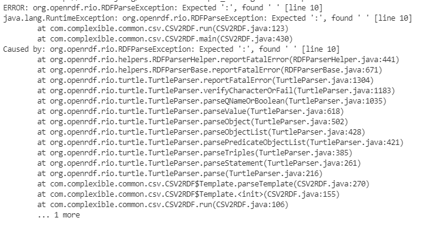

# Stresszteszt

Az alkalmazás jellegéből adódóan nehezen találni szűk keresztmetszetet rajta, hiszen egy szálon futó, rövid életű programról beszélhetünk. Két input fájlt kell megnyitnia, egy konverziót végezni és az eredményt kiírni.

## Program futásidejének mérése

Az egyedüli terhelési pontja a programnak az input fájl mérete, így az internetről letöltöttem egy példa .csv fájlt, mely kb. 100 000 sornyi adatot tartalmaz (ez a [stress_input.csv](../stress_test/stress_input.csv) fájlban található) és írtam hozzá egy erre illeszkedő template fájlt.

### Mérés

A lefutás idejét Windows PowerShellben, a Measure-Command parancs segítségével mértem. Nyolcszor futtattam le egymás után a parancsot, íme az eredmény egy táblázatban. A lefutások átlagosan **1148 ms** hosszúak voltak.

| Sorszám | Idő (ms) |
| ------- | -------- |
| 1       | 1187     |
| 2       | 1144     |
| 3       | 1052     |
| 4       | 1240     |
| 5       | 1124     |
| 6       | 1148     |
| 7       | 1133     |
| 8       | 1157     |

Összehasonlításként, egy `echo hi` parancs 5 ms alatt futott le.
A projektben példaként megadott cars.csv fájlon (5 sort tartalmaz) szintén végrehajtottam 8 lefutást, ezek átlaga **540 ms** lett.

### Kiértékelés

A futásidő a példa inputhoz képest durván megduplázódott a kb. 100 ezer extra sor hozzáadásával. Az eredmény átlagosnak mondható, nem száll el a lefutás ekkora inputtól. Némi számítással kijön, hogy kb. 6 ms a feldolgozási ideje minden 100 sornak a csv fájlban. (Persze az, hogy egy sor feldolgozási ideje mennyi, azt nagyban befolyásolja a template is. A számítások a stress_input csv és ttl fájlokra vonatkoztatva értetendőek.) Feltéve, hogy lineárisan növekedik a futásidő az input mérete függvényében, egy 1 milliárd soros csv esetén a program kb. 16 óráig futna. (Itt megint érdemes a nagyságrendet szem előtt tartani, nem a pontos értékeket.) A tervezett bemeneti fájlok mérete azonban ennél jóval kisebb, így ez reális gondot nem okoz, ilyen nagy fájloknál várható, hogy egy konverzió sem lesz pár perces futásidejű.

## Hibás szintaxis

A programban testreszabhatóak a különleges karakterek (escape, quote, stb). Ha ezeket mégis máshogy használnánk a fájlban, az a várt módon okozhat gondot, pl. parse-olásnál üres stringekkel töltheti fel az rdf szöveges literál értékeit. A template fájl megírásánál először nem idézőjelek közé tettem véletlenül a behelyettesítendő string értékeket, ekkor a fájlt értelmező RDFParser már akkor hibát dobott, mielőtt még a .csv fájlt elkezdte volna feldolgozni.

A manuális tesztek között végrehajtottunk olyan tesztet is, amikor a bemenő csv fájl nem tartalmaz sort. Ekkor a program maga ismeri fel a problémát és egy hibaüzenettel leáll a futás.

### Kiértékelés

A program a helyes lefutáshoz megköveteli a template fájl helyes szintaxisát. bármilyen szintaktikai hiba ahhoz vezet, hogy az RDFParser kivételt dob. Ez egy érthető elvárás, hiszen enélkül nem értelmezhető a konverzió.

A hiányos .csv fájlnál kevesebb gond van, ekkor max. egy-egy sorban léphetnek fel problémák, ha elcsúsznak az adatok. (Tehát szemantikailag lehet probléma a kapott fájlban, de a konverzió megtörténik.) Természetesen az sem meglepő, hogy üres fájlt nem tud a program feldolgozni.

> Összességében a stresszteszt megmutatta, hogy amennyiben szintaktikailag helyesek a bemeneti fájlok, a konverzió rendben lefut. A nagy méretű fájlok esetén
