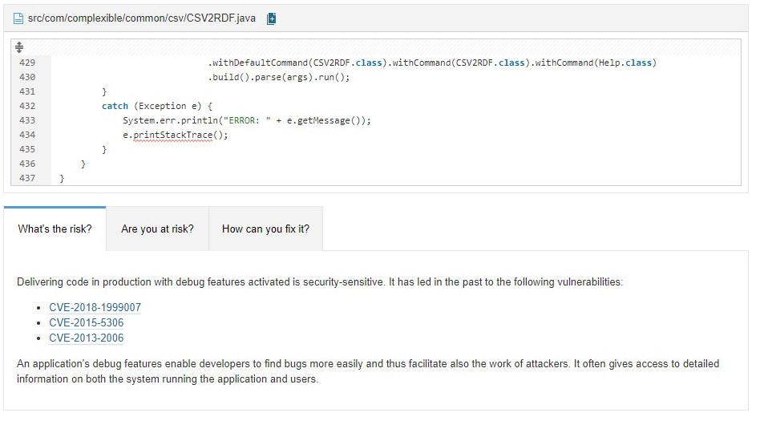

# SonarQube

## Telepítés

A SonarQubeot dockerrel telepítettem, így a következő parancs futtatása után már elérhetővé is vált a localhost:9000 címen:

```
docker run -d --name sonarqube -e SONAR_ES_BOOTSTRAP_CHECKS_DISABLE=true -p 9000:9000 sonarqube:latest
```

Az új projekt hozzáadása során Ant-es opció nem volt, így a sonar-scanner segítségével tudtam az elemzést elvégezni, melynek eredménye a következő:


Ezután Jakabos Csengével felváltva kezdtük el értelmezni és javítani a fellelt hibákat.

### Bug #1


Az itt látható hibaleírásban a statikus elemző azt a potenciális hibát vette észre, hogy a valueProviderFor() függvény térhet vissza null értékkel.
Két sorral később pedig a valueProvider-be navigálunk, amely null esetén NullPointerExceptiont dobhat.
Amit azonban a statikus elemző nem vett észre, az a közötte levő sor, a

```
Preconditions.checkArgument(valueProvider != null, "Invalid template variable", var);
```

ugyanis ebben a sorban a [Preconditions](https://guava.dev/releases/19.0/api/docs/com/google/common/base/Preconditions.html).checkArgument függvénye IllegalArgumentExceptiont fog dobni, abban az esetben, ha a valueProvider null. Így a nem várt NullPointerException nem következhet be, ugyanis a program futása hamarabb le fog állni.
Így a csapat megegyezett benne, hogy ez a hiba nem hiba, és a SonarQube-ban a false positive jelzést választottuk.

### Bug #2

A továbbiakban egy lehetséges biztonsági problémát jelzett a rendszer:


A SonarQube ajánlása szerint különösen akkor van veszély, ha a kódot production környezetben használjuk így, ez azonban nem áll fenn.
Annak ellenére, hogy nem feltétlenül volt szükséges gyakorlásképpen javítottuk ezt a hibát:

- A utils beépített loggerét használva lecseréltük az alábbi sorokat:

```
catch (Exception e) {
			System.err.println("ERROR: " + e.getMessage());
			e.printStackTrace();
		}
```

- Erre:

```
private final static Logger LOGGER = Logger.getLogger(Logger.class.getName());
...


LOGGER.log(Level.SEVERE,e.getMessage());
```
A SonarQube által jelzett codesmell miatt javítva:

```
private static final Logger LOGGER = Logger.getLogger(CSV2RDF.class.getName());
```

### System.out lecserélése Logger-re:

A korábbiakban említett loggert használva az alábbi sorok változtak:

Korábban:

```
	System.out.println("CSV to RDF conversion started...");
	System.out.println("Template: " + templateFile);
	System.out.println("Input   : " + inputFile);
	System.out.println("Output  : " + outputFile);
```
Frissített verzió:
```
	LOGGER.info("CSV to RDF conversion started...");
	LOGGER.log(Level.INFO,"Template: {0}",templateFile);
	LOGGER.log(Level.INFO,"Input   : {0}",inputFile);
	LOGGER.log(Level.INFO,"Output   : {0}",outputFile);
```	
Korábban:
```
	System.out.printf("Converted %,d rows to %,d triples%n", inputRows, outputTriples);
```
Frissített verzió:
```
	LOGGER.log(Level.INFO,"Converted {0} rows to {1} triples%n", new Object[] {inputRows,outputTriples});
```
Itt azért van szükség az objektum létrehozárása, mert több paramétert szeretnénk megadni kiíráskor.
