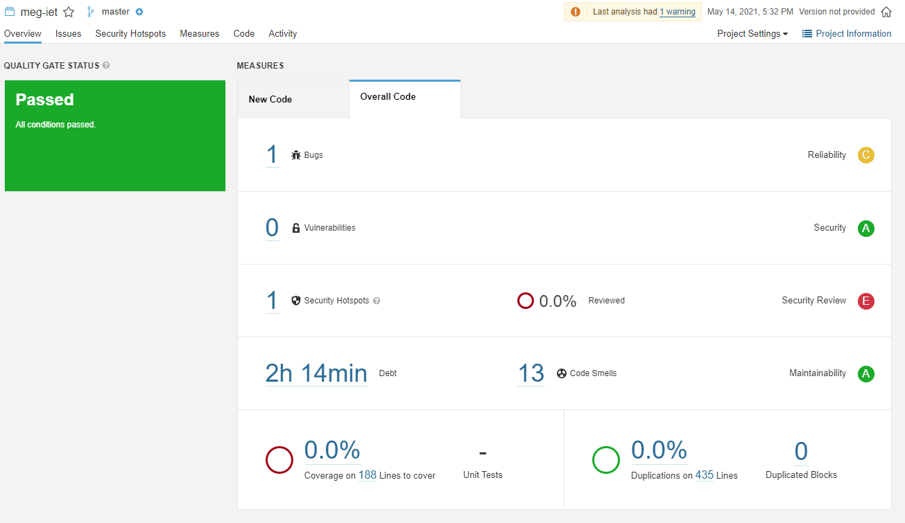
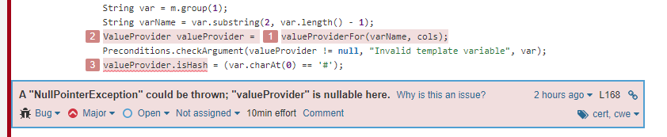

# SonarQube

## Telepítés

A SonarQubeot dockerrel telepítettem, így a következő parancs futtatása után már elérhetővé is vált a localhost:9000 címen:

```
docker run -d --name sonarqube -e SONAR_ES_BOOTSTRAP_CHECKS_DISABLE=true -p 9000:9000 sonarqube:latest
```

Az új projekt hozzáadása során Ant-es opció nem volt, így a sonar-scanner segítségével tudtam az elemzést elvégezni, melynek eredménye a következő:



Ezután Jakabos Csengével felváltva kezdtük el értelmezni és javítani a fellelt hibákat.

### Bug #1



Az itt látható hibaleírásban a statikus elemző azt a potenciális hibát vette észre, hogy a valueProviderFor() függvény térhet vissza null értékkel.
Két sorral később pedig a valueProvider-be navigálunk, amely null esetén NullPointerExceptiont dobhat.
Amit azonban a statikus elemző nem vett észre, az a közötte levő sor, a

```
Preconditions.checkArgument(valueProvider != null, "Invalid template variable", var);
```

ugyanis ebben a sorban a [Preconditions](https://guava.dev/releases/19.0/api/docs/com/google/common/base/Preconditions.html).checkArgument függvénye IllegalArgumentExceptiont fog dobni, abban az esetben, ha a valueProvider null. Így a nem várt NullPointerException nem következhet be, ugyanis a program futása hamarabb le fog állni.
Így a csapat megegyezett benne, hogy ez a hiba nem hiba, és a SonarQube-ban a false positive jelzést választottuk.
